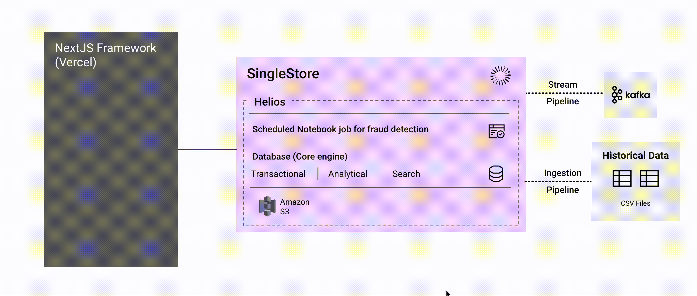

# S2 Fraud Detection Demo

A real-time fraud detection demo using SingleStore, Kafka, and Next.js. This project demonstrates how to stream, detect, and visualize fraudulent ATM transactions in real time.



## Why This Project?

- **Showcase SingleStore's real-time analytics:** Demonstrates how SingleStore can power instant fraud detection and analytics on streaming data, leveraging its high-performance, distributed SQL engine.
- **End-to-end streaming with SingleStore Pipelines:** Ingests data directly from Kafka into SingleStore using native pipelines—no external ETL required.
- **Multi-model and geospatial capabilities:** Uses SingleStore's support for relational, time series, and geospatial data to detect and analyze fraud patterns.
- **Automated analytics with Scheduled Jobs:** Highlights how SingleStore's built-in scheduled jobs can automate complex analytics and fraud detection logic, all within the database.
- **Cloud-native and developer-friendly:** Built to run on SingleStore Cloud, with easy integration for modern app stacks (Next.js, Python, Kafka, etc.).
- **Educational and extensible:** Serves as a reference for building real-time, cloud-native analytics solutions with SingleStore at the core.

## Architecture

1. **Kafka Data Generator:**  
   Generates synthetic ATM transactions and user data, publishing to Kafka topics.
2. **SingleStore Pipelines:**  
   Ingests streaming data from Kafka directly into the database.
3. **Scheduled Fraud Detection Job:**  
   Periodically analyzes transactions for suspicious activity using geospatial and temporal logic.
4. **Next.js Dashboard:**  
   Visualizes fraud events, analytics, and maps in real time.

_Data Flow:_
```
Kafka Script (EC2) → SingleStore Pipelines → Scheduled Job (Helios) → Next.js Dashboard (Vercel)
```

## Quickstart

### Prerequisites

- Node.js >= 18
- Python >= 3.8
- Access to [SingleStore Cloud](https://www.singlestore.com/cloud-trial/)  
  Don’t have an account? [Sign up for free here.](https://portal.singlestore.com/start-free)
- Access to a Kafka broker (self-hosted or [Confluent Cloud](https://www.confluent.io/cloud/))

> For a hands-on introduction to SingleStore, see the official [Getting Started with SingleStore](https://www.singlestore.com/spaces/getting-started-with-singlestore/) notebook.

### 1. Clone the repo

```bash
git clone https://github.com/prabhanshuchauhan/s2_realtime_fraud_demo.git
cd s2_realtime_fraud_demo
```

### 2. Set up the database

- Create a SingleStore Cloud workspace.
- Run `schema.sql` to create tables, pipelines, and procedures.

### 3. Configure and run each component

#### Frontend (Next.js)

- See [s2_fraud_detection_demo/README.md](./s2_fraud_detection_frontend/README.md) for setup and environment variables.

#### Kafka Data Generator

- See [kafka_script/README.md](./kafka_script/README.md) for setup, dependencies, and usage.

#### Scheduled Job

The scheduled fraud detection job runs in SingleStore Helios and flags suspicious transactions.  
To learn more about automating tasks with scheduled jobs in SingleStore, check out [Leveraging the Simplicity of Scheduled Jobs](https://www.singlestore.com/blog/leveraging-the-simplicity-of-scheduled-jobs/).

- See [Scheduled_Job/README.md](./Scheduled_Job/README.md) for notebook usage.

## Simulating Fraud

- The generator will occasionally create transactions that are impossible (e.g., same user in two distant cities within secods/minutes).
- These are flagged by the scheduled job and appear in the dashboard.

## Troubleshooting

- **SSL errors:** Ensure your `SINGLESTORE_CERT` is set correctly (see frontend README).
- **Kafka connection issues:** Check broker address and network/firewall settings.
- **No data in dashboard:** Make sure all components are running and connected.

## Contributing

See [CONTRIBUTING.md](./CONTRIBUTING.md)

## License

MIT 